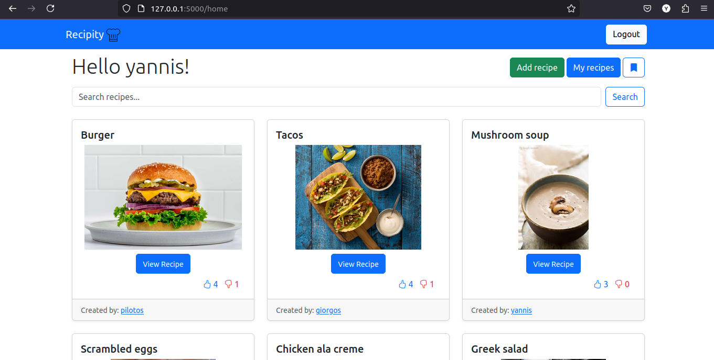
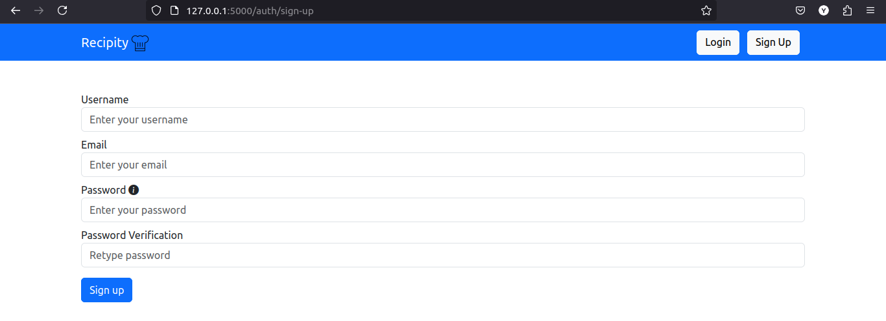
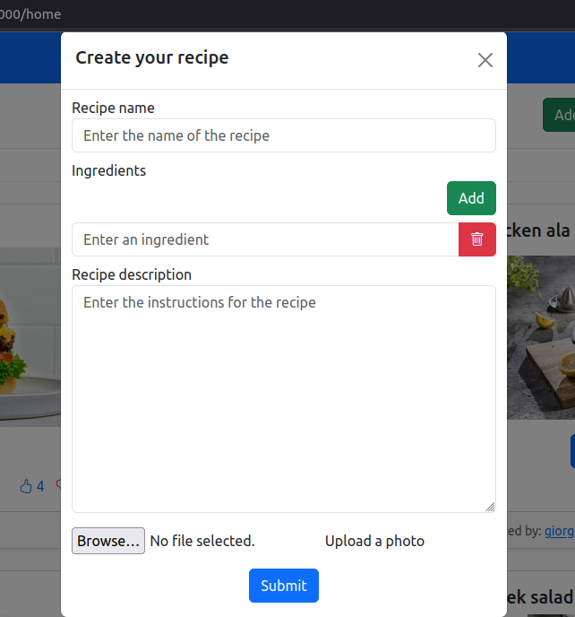
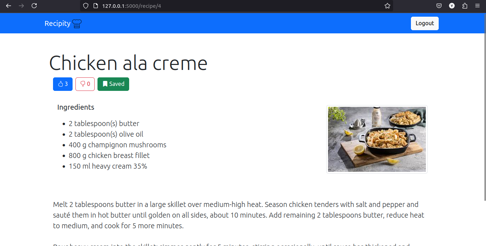
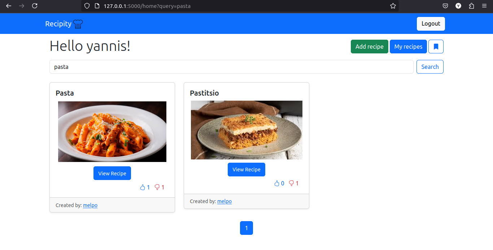
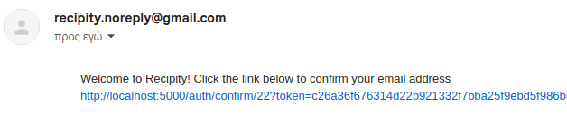

# Recipity :fork_and_knife:
#### A full stack application using Flask and Jinja templates where users can create an account and explore new and exciting recipes !



## Features

### Login system
Users can create their account and activate it via mail :email:. Only then they can have access to the platform and all of its features.



### Uploading recipes
Any user can upload his own recipe, ingredients and steps required along with a photo of the final result.



### Viewing recipes
Recipes can be liked, disliked and saved. Depending on the like-dislike ratio, recipes are ranked higher and recommended to each user in the home page. For better performance pagination is used on the recipe preview pages. There is also a search bar that helps find recipes based on key phrases.




## Setup and run :computer:

First we need to setup our environment and install the dependencies
``` 
python -m venv .venv
source .venv/bin/activate
pip -r install requirements.txt
```

After that, a .env file is required that will look like this:
```
SECRET_KEY="my_secret_key"
MAIL_USERNAME="recipity@gmail.com"
MAIL_PASSWORD="password"
```
For the email verification to work, I followed 2 steps:
- Enabled 2 factor authentication
- Created an app specific password (generated from gmail)



The above was tested only with Gmail and took about 5 mins for the email to arrive in the spam folder.

Final step is to run our app:
```
python main.py
```